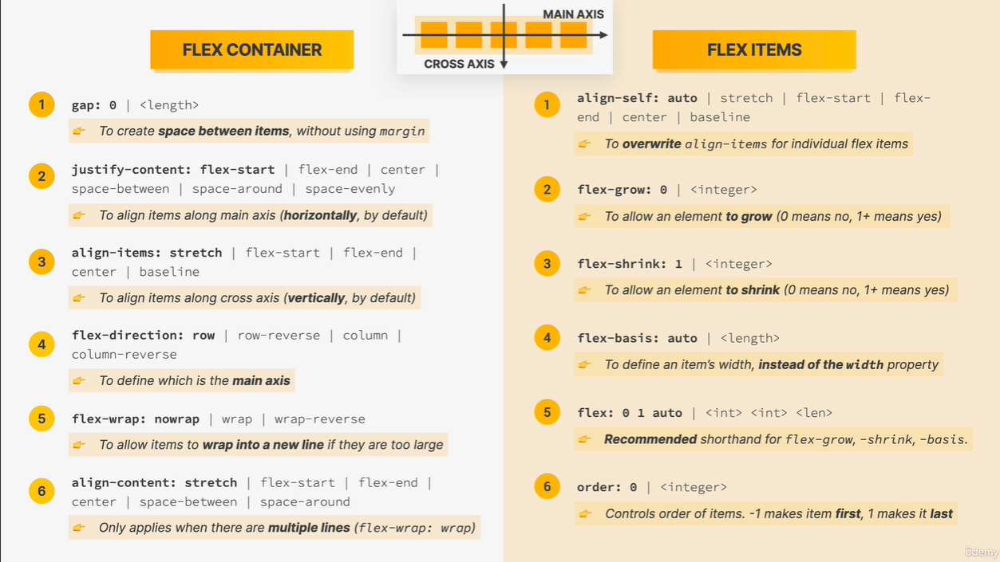

# 📚 html-css-course

## 🎓 LAYOUTS: Floats, Flexbox and CSS Grid Fundamentals

### 📝 What is Flexbox?

- **Flexbox**

  - Flexbox is a set of related CSS properties for building 1-dimensional layouts
  - The main idea behind flexbox is that empty space inside a container element can be automatically dividided by its child elements
  - Flexbox makes it easy to automatically align items to one another inside a parent container, both horizontally and vertically
  - Flexbox solves common problems such as vertical centering and creating equal-height columns.
  - Flexbox is perfect for replacing floats, allowing us to write fewer and cleaner HTML and CSS code.

- **Flexbox terminology**
  - display:flex;

- First property is the default, and then the other options.
- Flex container
- Flex item
